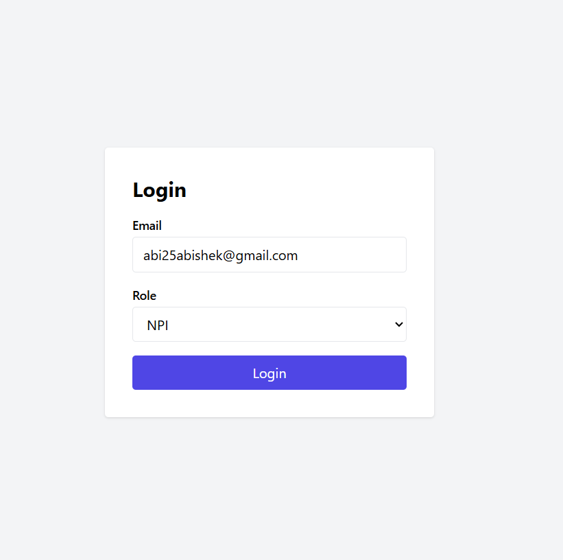
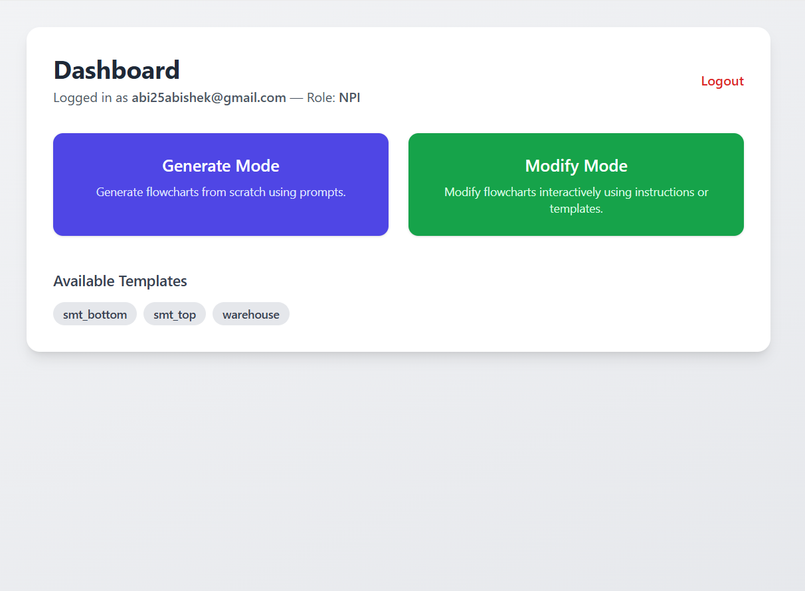
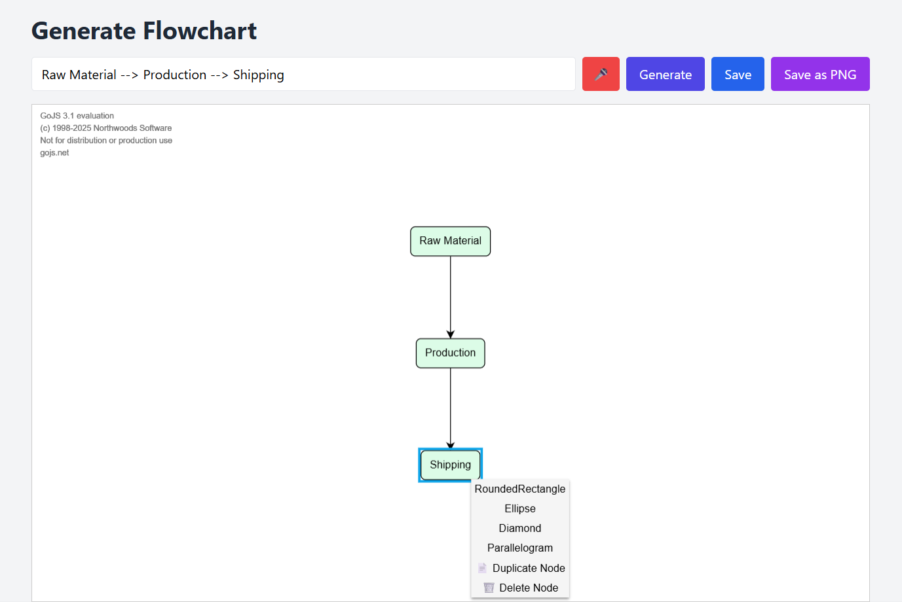
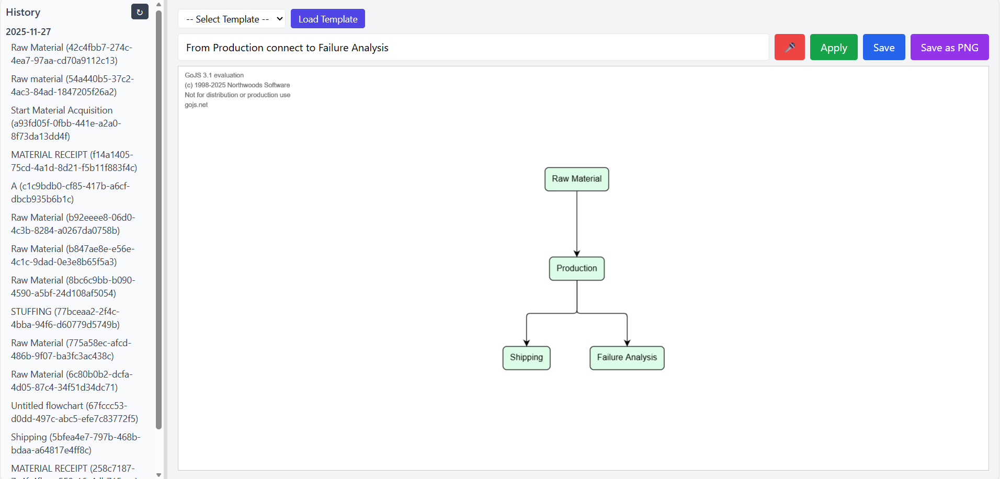

# Gemini-Powered-Flowchart-Generation-Editing-App
An intelligent Flowchart Generation & Editing Web Application powered by Google Gemini, built with Flask, and supporting fully interactive flowchart rendering using GoJS.

Users can generate flowcharts from natural language, modify them using text instructions, save/load versions, and apply role-based templates — all secured per user session.

**🚀 Features**

**🔹 AI-Powered Flowchart Generation**

Converts plain English prompts into valid GoJS JSON models.

**Supports shapes:** RoundedRectangle, Ellipse, Diamond, Parallelogram.

**🔹 AI-Based Flowchart Modification**

Update existing flowcharts using simple instructions like:

**“Replace Step 2 with ‘Verify BOM’”**

Gemini updates only what user instructs.

**🔹 User Authentication**

Email + role-based login.

Sessions stored securely using Flask sessions.

**🔹 Role-Based Template System**

Different roles get different default flowcharts:

**NPI:** warehouse, smt_top, smt_bottom

**Quality:** wave_soldering, selective_soldering

**🔹 History & File Management**

Every flowchart stored as:

session_files/{email}__{session_id}.json

**Supports:**

Save

Load

Modify

Download

Delete

**🔹 REST API for Flowcharts**

Clean endpoints for frontend or external tools.

**🛠 Tech Stack**

Component	Technology

Backend	Flask

AI Model	Google Gemini (flash-latest)

Frontend Renderer	GoJS

Templates	JSON-based stored in templates_data/

Storage	Local filesystem (session_files/)

Environment	python-dotenv

**📁 Project Structure**

**📦 project**

├── app.py                 # Flask server (routes, auth, APIs)

├── backend.py             # Gemini logic, storage, templates

├── templates/             # HTML templates for UI

├── session_files/         # Auto-created user flowchart JSON files

├── templates_data/        # Role-based JSON templates

├── .env                   # Gemini API key 

├── requirements.txt       # Python dependencies

└── README.md              # Project documentation

**🔐 Setup Instructions**

**1️⃣ Clone the repository**

git clone https://github.com/your-username/flowchart-generator.git

cd flowchart-generator

**2️⃣ Create & activate virtual environment**

python -m venv venv

source venv/bin/activate     # Linux/Mac

venv\Scripts\activate        # Windows

**3️⃣ Install dependencies**

pip install -r requirements.txt

**4️⃣ Configure environment variables**

Create .env:

GOOGLE_API_KEY=YOUR_API_KEY_HERE

FLASK_SECRET_KEY=yourrandomsecretkey

**▶️ Run the Application**

python app.py

App runs locally on:

http://127.0.0.1:5000/

**🌐 API Endpoints Overview**

**Flowchart Generation**

POST /flowchart/generate

Generate a new GoJS JSON model.

**Modification**

POST /flowchart/modify

Modify an existing JSON model.

**Save**

POST /flowchart/save

**Load**

POST /flowchart/load

**History**

GET /history/list

GET /history/open/<session_id>

GET /history/download/<session_id>

DELETE /history/delete/<session_id>

**Templates**

GET /templates/list

GET /templates/load/<name>

**🧠 How It Works**

1. User enters a natural language prompt

**Example:**

“Create a decision node 'inspection'”

**2. Backend sends instruction to Gemini**

With strict rules:

Return JSON only

Must include nodeDataArray, linkDataArray, shapes, loc coordinates

**3. Gemini returns valid GoJS JSON**

**4. Flask saves it as**

session_files/{email}__<uuid>.json

**5. Frontend renders it using GoJS**
   
**📚 Role-Based Templates**

|  Role  |	 Templates   |
|--------|---------------|
| NPI	  | warehouse, smt_top, smt_bottom |
| Quality	| wave_soldering, selective_soldering |

**Stored in:**

templates_data/*.json

## 📸 Screenshots

### 🔹 Login

### 🔹 Dashboard

### 🔹 Generate Tab

### 🔹 Modify Tab

